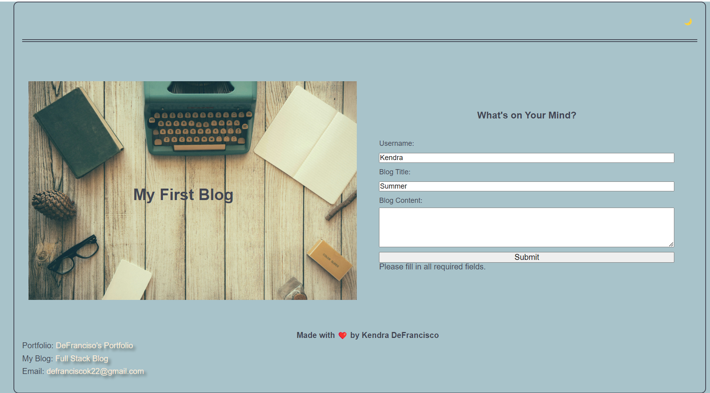
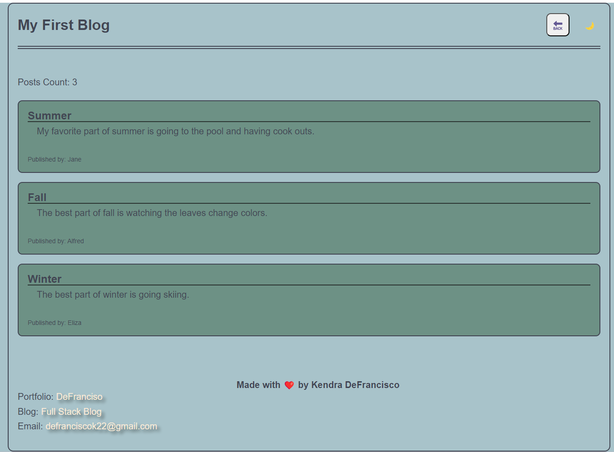

# <Your-Project-Title>

## Description

As I wanted a platform to make a website where a user can type their own blog post and have it stored locally and displayed on the site. I learned how to utilize CSS, JS, and Web API's to create this website. 

## Usage

Main form page.
    

Error on form page.
    

Blog entry page.
    

## License

Please review the license attached in the repo.

